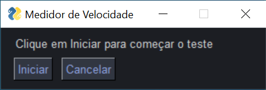
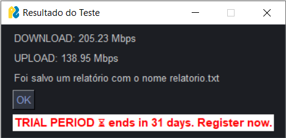
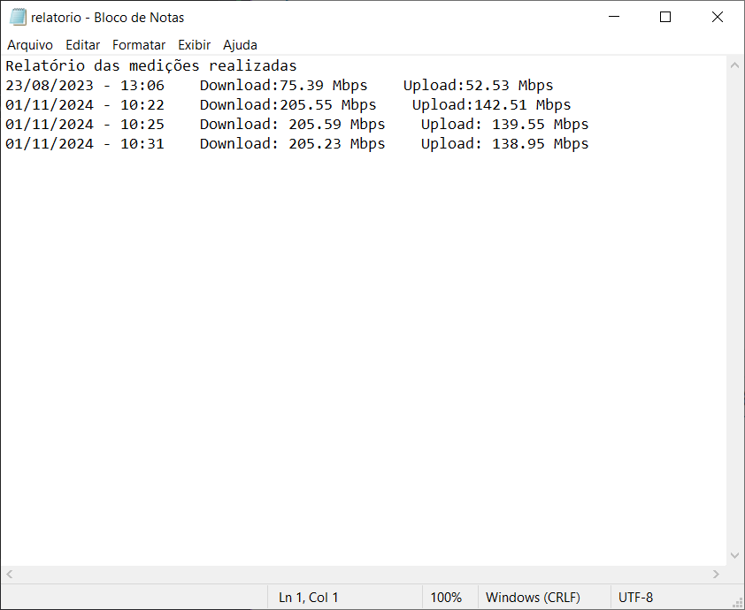

# Medidor de velocidade de internet

## Dependencias
- speedtest-cli
- pandas
- pysimplegui

## Como usar
Execute o <strong>main.py</strong> e selecione ok, após isso os dados serão exibidos na tela e salvos no arquivo txt.

||
| ------------- |

||
 ------------- |

||
